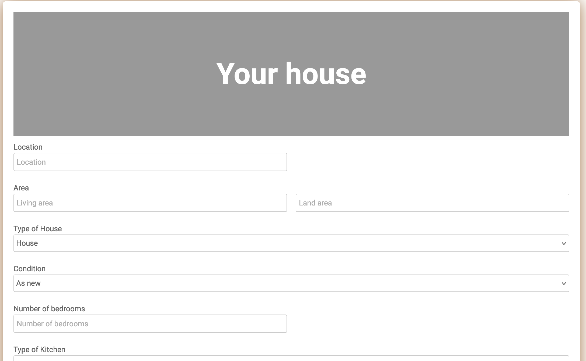

# Immo-Eliza-deployment

## Description
We were tasked with creating an web application that takes in housing data and predicts a price for this house. The main focus of this project was the deployement of a Machine Learning model through Docker and Heroku.

The deployed application can be found [here](https://eliza-price-predictor.herokuapp.com/)

The dataset used for this project comes from an earlier [webscraping project](https://github.com/BertramDHooge/challenge-collecting-data).

## Installation
A Dockerfile is present so after downloading on a local machine, a Docker container can be created to run the app.

If you not familar with Docker, check if the right packages installed in the requirement.txt. Then run app.py.

## Usage

Open a webbrowser to [http://localhost:5000](http://localhost:5000). The homepage will welcome you and you will find two buttons. The first one leads to a form where you can enter the details of a house. The site will calculate a prediction for you.

The second button leads to a page where you can update the dataset or the model. The updating of a database is not functional yet and the site won't do anything with the data entered here. It does retrain the model but on the same dataset.

## Visuals
   
 

